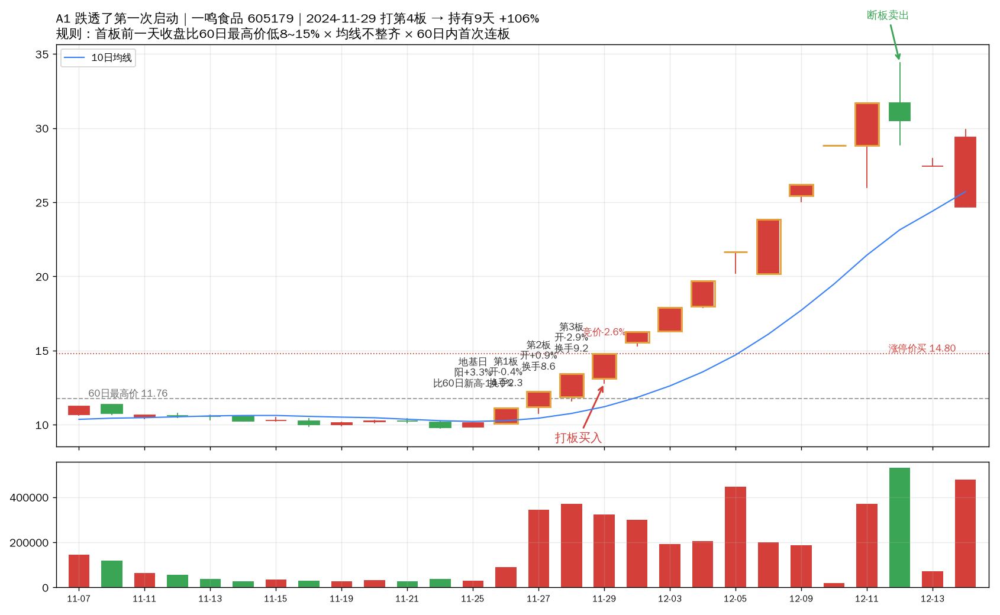
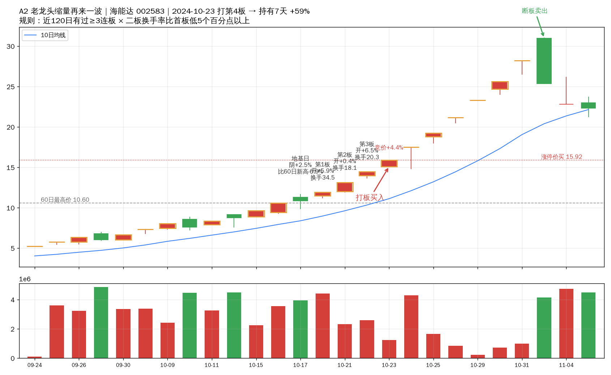
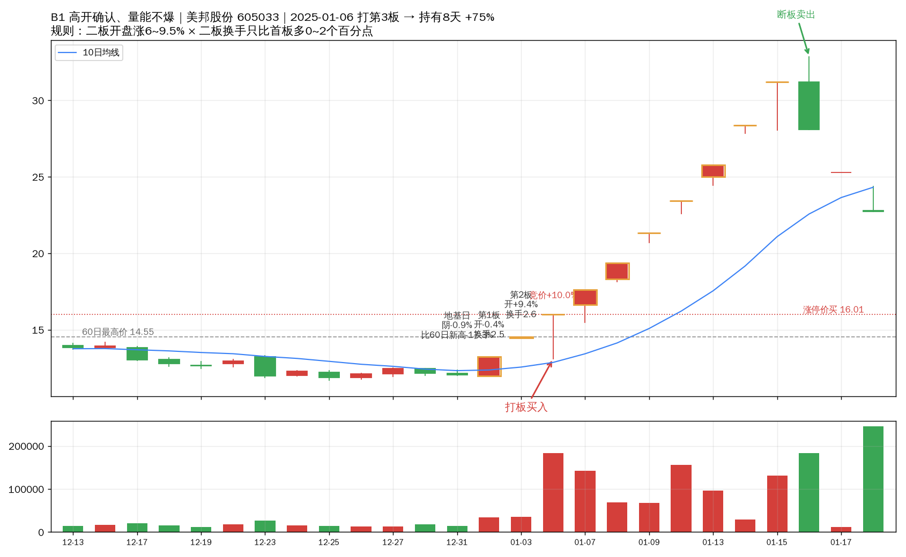
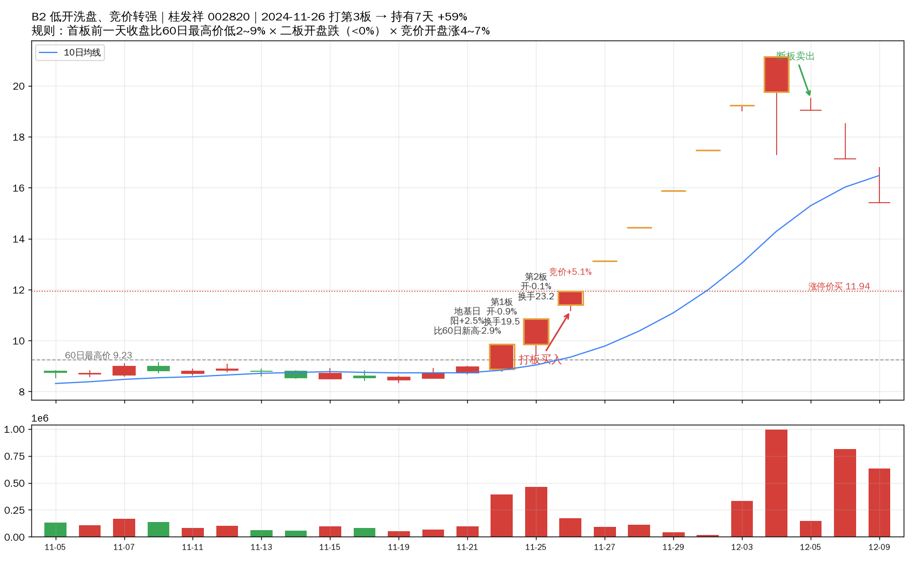
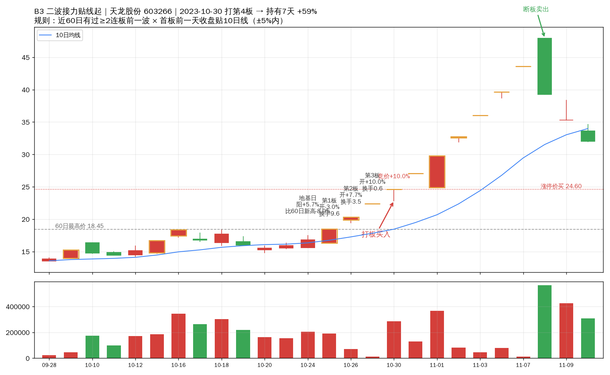

# 高位接力 · 规则图解（五张真实K线讲规则）

（规则全文见 `高位接力规则.md`。这里每个方案点挑一票历史命中的真实票，
把「地基日、首板、二板、三板、打板买入、断板卖出」标在K线上对照着讲。
红蜡烛=涨，绿蜡烛=跌，金边=涨停，蓝线=10日均线，灰虚线=60日最高价，红虚线=打板买价。）

## A1 修复启动（三接四阳）：一鸣食品，2024-11-29 打第4板 → 9天 +106%

看图三处：
1. **位置低**：地基日（首板前一天）是阳线+3.3%，但收盘价比60日最高价还低14%
   （灰虚线在上面压着）——跌透了，符合「低8~15%」；
2. **60天内没炒过**：图左两个多月没有一根涨停，这是第一次启动（60日内首次连板）；
3. **链条全是换手板**：首板开-0.4%、二板开+0.9%、三板开-2.9%，每天都是实体/下影线
   有来有回的板，不是一字通道——有人气承接。竞价-2.6%低开，早盘冲板，涨停价14.80打进，
   之后6连板，断板日收盘卖，+106%。

## A2 老龙缩量（三接四阴）：海能达，2024-10-23 打第4板 → 7天 +59%

看图三处：
1. **老龙头**：近120天内已经有过3连板以上（前面炒过一波，有辨识度）；
2. **缩量锁定**：首板换手34.5% → 二板换手18.1%，少了16个百分点（要求5个点以上）——
   持有的人不愿意卖了；
3. **竞价合规**：买入日竞价+4.4%，在0~9.5%的可打区间（低开或≥9.5%顶格开是毒格）。
   地基日是阴线（收<开）但其实涨了+2.4%——假阴线也算阴，分组看收盘vs开盘。
   涨停价打进后再连4板，+59%。

## B1 竞价确认（二接三阴）：美邦股份，2025-01-06 打第3板 → 8天 +75%

看图三处：
1. **地基小阴**：首板前一天是-0.9%的小阴线（分组要求阴地基）；
2. **二板高开确认**：二板开盘+9.4%，落在6~9.5%窗口——开得够高说明强，
   又没到顶格留出了换手空间；
3. **换手不爆**：二板换手2.6% vs 首板2.5%，只多0.1个点（要求0~2点）——
   高开但量能没散，筹码锁住了。买入日竞价顶格+10%也能打
   （B1没有竞价回避，历史数据里顶格反而更好），+75%。

## B2 低开转强（二接三阳）：桂发祥，2024-11-26 打第3板 → 7天 +59%

看图三处：
1. **位置不贴顶**：地基日阳线+2.5%，收盘比60日最高价低2.9%（要求2~9%窗内）——
   离前高不远但还没贴上去；
2. **二板低开洗盘**：二板开盘-0.1%（低开，涨幅<0%）——前一天首板、第二天低开，
   把追高的浮筹洗出去；
3. **竞价转强确认**：买入日竞价+5.1%，正好落在4~7%窗口——低开之后还能高开这么多，
   说明洗盘结束要上了。涨停价11.94打进，再连5板，+59%。
   （三个条件缺一不可：位置窗管「没涨透」、低开管「洗过」、竞价窗管「确认」。）

## B3 二波贴线（三接四阳）：天龙股份，2023-10-30 打第4板 → 7天 +59%

看图三处：
1. **有前一波**：60天内已经有过一次2连板以上（图左能看到前面的涨停），
   这是第二波，不是第一次启动（和A1正好互补）；
2. **地基贴10日线**：首板前一天是阳线+5.7%，收盘贴着蓝色的10日均线（±5%以内）——
   回调到均线附近企稳，没暴涨透支；
3. **链条走强**：首板开-3%（下影板）→ 二板开+8% → 三板一字，一波比一波强。
   涨停价打进后再连4板，+59%。

## 执行提醒（五张图通用）

- **买**：上面五种形态，只在 **9:30~9:45 第一次触板**时按涨停价打；
  9:45后才摸板、下午2:30后摸板、一字板封死买不进，都放弃。
- **回避**：竞价太弱（<0%）或太顶（≥9.5%）的三接四阴、地基贴新高3%内的三接四阳、
  「实体→实体」二接三阴、「实体→下影→下影」三接四阴、「一字→一字且竞价≥9.5%」二接三阳——
  形态再像也不买。
- **卖**：当天没封住，收盘就走；封住了，拿到不再涨停那天收盘走，最多15天。
